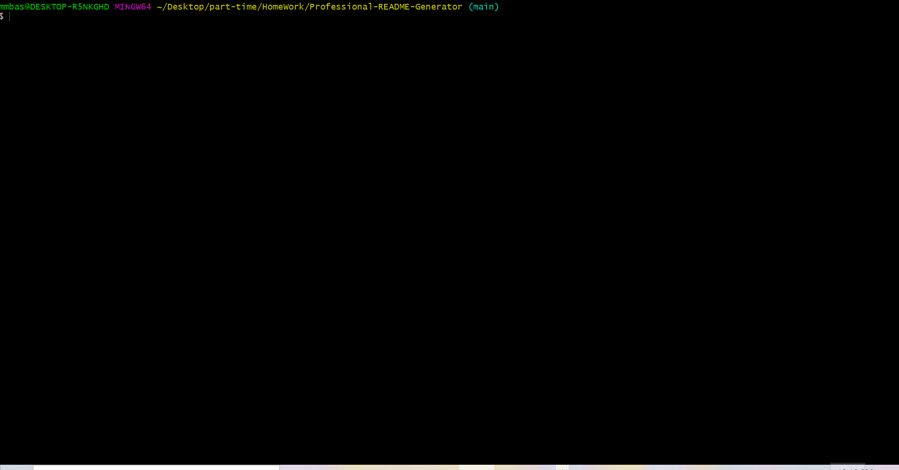

# Professional-README-Generator 

    
## Table of Contents
- [Description](#Description)
- [Installation](#Installation)
- [Usage](#Usage)
- [Contributing](#Contribution)
- [Tests](#Tests)
- [License](#License)
- [Contact](#Contact)
- [Link to Repository](#Repository)
- [Link to Deployed page](#Deployed)
    
## Description
a command-line application that dynamically generates a professional README.md file from a user's input
        
## Installation
open file in Gitbash terminal and run comand line "node index.js" then follow prompt
        
## Usage
Demo  

        
## Contribution
Mohamed Bassiouni
        
## Tests
undefined
        
## License
This project is licensed under the terms of the following license: 
    

    
        
## Contact
GitHub: [Mohamedb-01 ](https://github.com/Mohamedb-01 ). 
    
For inquiries, please contact m.m.bassiouni@gmail.com.
    
## Link to Repository 
https://github.com/MohamedB-01/Professional-README-Generator
    
## Link to Deployed page
NA